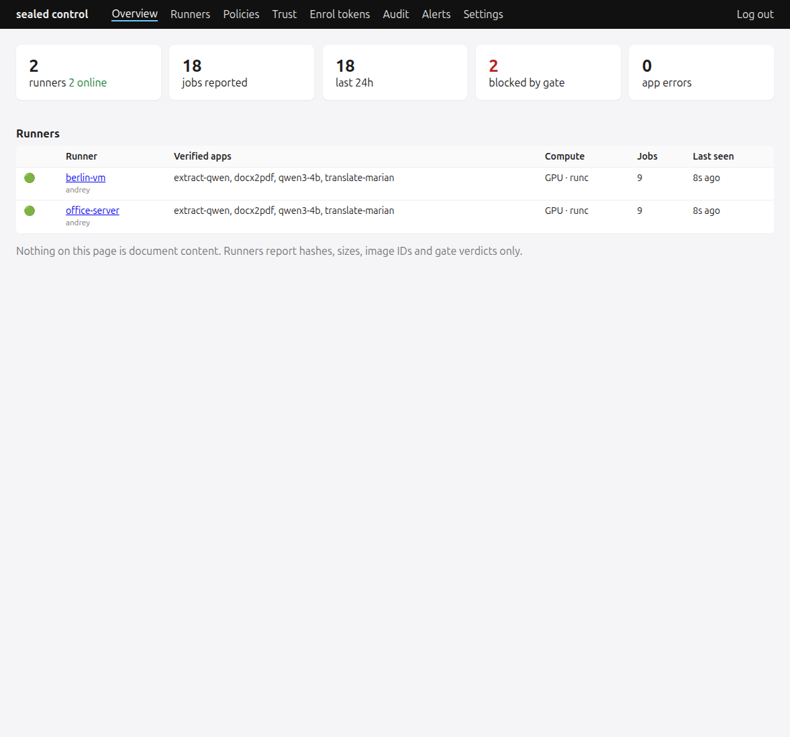

# sealed

[](LICENSE)

Run apps on confidential data **with no way out**. AI models, format converters, OCR, redaction, any service that
transforms a document.

An app in this network never receives your data. It ships a container. Your runner executes that
container with no network, no writable filesystem, no capabilities, and one exit: an output gate you
control. "Read but not share" is not a promise. It is the kernel refusing the process a socket.

```
your app ──▶ gateway ──▶ sandbox (docker: --network none --read-only --cap-drop ALL …) ──▶ gate ──▶ result
                │                       ▲                                                   │
                │                verified image (digest-pinned)                        audit log
                └──────────────── policy (what may run, what may come out) ─────────────────┘
```

Works on a laptop, an office server, or a VM in your own cloud account. Nothing is hosted by us.

## Quick start

```bash
make setup                 # python venv with the `sealed` CLI
make tools                 # static strace for intent detection during verify (from alpine, one time)
make apps                  # build the CPU community apps (downloads ~3 GB of weights once)
make verify                # admission pipeline: images must pass to become usable
make test                  # proves the sandbox with a deliberately malicious image, then runs text, document and gateway jobs
make verify-gpu            # optional quality tier: Qwen3-4B, CUDA build (~25 GB image, NVIDIA GPU with 12+ GB)
```

Then:

```bash
S=.venv/bin/sealed
echo "This agreement is confidential." | $S run translate-marian --op translate -p source=en -p target=de
$S run translate-marian --op translate -p source=en -p target=de --file contract.docx --out contract.de.docx   # docx, txt, md, pdf
$S run extract-qwen --op extract --file contract.docx
$S run docx2pdf --op convert --file contract.docx --out contract.pdf                 # not AI: LibreOffice in the same sandbox
$S run qwen3-4b --op translate -p source=en -p target=ru --file contract.docx      # quality tier, any language pair, uses the GPU
$S serve                   # HTTP gateway on 127.0.0.1:8470
```

Gateway auth: `sealed keys create --label myapp` prints a key once; from then on every `/v1` call needs
`Authorization: Bearer sk_...`. Keys can be limited to policies. With no keys the gateway only binds localhost.

Gateway API: `POST /v1/jobs` (JSON text jobs), `POST /v1/files` (multipart upload: docx/txt/md/pdf in, same format out
for translate, JSON for extract/summarize/classify), `GET /v1/apps`, `GET /v1/pool`, `GET /v1/audit`.

Or as a service: `docker compose up -d`. Two containers: the **gateway** on 127.0.0.1:8470 (no Docker socket,
read-only, no capabilities) and the **launcher** on an internal-only network, the single process holding the
Docker socket. The launcher accepts exactly one request type: run operation X of an allowlisted image ID on this
input. It resolves the image from the allowlist, never from the request. Both share `~/.sealed` with the host, so
`sealed verify` on the host feeds the same allowlist.

## What is in the box

| Piece | Where | What it does |
|---|---|---|
| Sandbox contract | `runner/sealed/sandbox.py` | The docker flags every job runs with. Images cannot opt out. `sealed contract <image>` prints them. |
| Gate | `runner/sealed/gate.py` | Enforces output rules (size, allowed keys, verbatim-copy limit) and writes the audit line. |
| Verify | `runner/sealed/verify.py` | Admission pipeline. Produces a report and adds the image ID to the allowlist. |
| Gateway | `runner/sealed/gateway.py` | Local HTTP API for your applications. Confidential policies only route to verified images. |
| Policies | `policies/*.yaml` | `confidential` (verified only, strict) and `standard` (any image, still sandboxed). |
| Spec | `spec/` | Manifest schema and the stdin/stdout job protocol an app must implement. |
| Warm pool | `runner/sealed/pool.py` | One loaded container per app kept alive between jobs (same sandbox). First job pays the model load, later jobs take milliseconds. |
| Documents | `runner/sealed/documents.py` | docx/txt/md/pdf in, chunked into jobs, rebuilt with formatting and tables kept (pdf comes back as txt). |
| Apps | `apps/` | `translate-marian` (OPUS-MT, 6 pairs, CPU), `extract-qwen` (Qwen2.5-1.5B, CPU), `qwen3-4b` (quality tier: translate any pair, summarize, extract, classify; GPU), `docx2pdf` (LibreOffice, not AI), `evil` (test image). |

## The admission pipeline (`sealed verify`)

1. **Provenance.** Image resolves to a content-addressed ID. The allowlist stores IDs, never tags.
2. **Manifest.** `/sealed/manifest.json` validates against the schema.
3. **Config.** Image must not declare ports or volumes and must not run as root.
4. **Sandbox probe.** From inside the image: egress, rootfs write, setuid all fail.
5. **Conformance.** The image's own fixtures run for every declared operation under the real sandbox.
6. **Intent.** First fixture runs under strace. Any attempt at `socket(AF_INET…)`, `connect`, `mount`,
   `setuid`, `ptrace` and friends rejects the image, even though the sandbox blocked it.
7. **Canary.** A unique token flows through a strict gate policy end to end.
8. **Scan.** Trivy critical CVEs if trivy is installed (advisory).

`apps/evil` is a "translator" that tries HTTP, DNS, raw sockets, rootfs writes, the docker socket,
setuid and mount. `make test` shows all attempts blocked and the image rejected at step 6.

## Registry: publish and install (no image hosting)

Nobody downloads images. A publisher signs a **source package** (Dockerfile, handler, manifest with pinned model
revisions, conformance fixtures) after building and verifying it locally. A user fetches the package, checks the
signature and hash, **builds the image on their own machine**, and runs the same admission pipeline. The
guarantee comes from the user's own `verify` run, the publisher's signature only says "this is the source I stand behind".

```bash
# publisher
sealed keygen                                                  # Ed25519 key in ~/.sealed/keys, trusted locally
docker build -t sealed/translate-marian:0.3.0 apps/translate
sealed verify sealed/translate-marian:0.3.0
sealed sign apps/translate --image sealed/translate-marian:0.3.0   # writes registry/<name>-<ver>.src.tar.gz + .json + index.json
# user
sealed trust <publisher public key> "sealed community"
sealed catalog --registry https://raw.githubusercontent.com/<org>/sealed/main/registry
sealed install translate-marian --registry <same url>          # fetch, check, build (downloads pinned weights), verify, allow
sealed install qwen3-4b --build-arg TORCH=cu128 --gpu           # CUDA variant on a GPU host
```

Model weights are pinned to Hugging Face commit revisions in each manifest and fetched at build time, so two users
building the same package get the same weights. Costs nothing to host: the registry is a directory of small files
served from anywhere (this repo, a static bucket, a file share).

## Fleet: control plane, agent, one-line install

For more than one machine, or for deploying into a customer's cloud account, run the control plane and enrol runners.
The control plane holds policies, trusted publisher keys, the registry URL, and audit **metadata** (hashes, sizes,
image IDs, gate verdicts). It has no path to document content: the runner's agent is the only outbound component
and the audit format contains none.

```bash
# control plane (anywhere your runners can reach; metadata only, so a small VM is fine)
SEALED_CONTROL_ADMIN_TOKEN=$(openssl rand -base64 24) docker compose -f deploy/control-compose.yml up -d --build
curl -X POST http://control:8480/v1/admin/enroll-tokens -H "authorization: Bearer $SEALED_CONTROL_ADMIN_TOKEN" -d '{"label":"office-server"}'

# runner: fresh Ubuntu machine or VM (or paste deploy/cloud-init.yaml as VM user-data)
SEALED_CONTROL=http://control:8480 SEALED_ENROLL_TOKEN=enr_xxx bash -c "$(curl -fsSL https://raw.githubusercontent.com/Andrew1326/sealed/master/deploy/install.sh)"
```

The installer puts Docker in place, trusts the community publisher key, builds and verifies the requested apps
locally, enrols, and starts gateway + launcher + agent.

The control panel at `http://control:8480/` (sign in with the admin token) has: overview, runners with detail and
per-runner policy/runtime overrides, a policy editor with validation, trusted publisher keys, enrol tokens with the
ready-made install one-liner, an audit browser with filters and JSON export, alerts with a webhook for blocked
outputs and app errors, and settings. Everything is also available as JSON under `/v1/admin/*`.



Policies and trusted keys pushed from the control plane are applied by the agent on the next heartbeat and take
precedence over the repo's `policies/`.

## Measured on this machine (RTX 5080, 32 cores)

| Job | Cold | Warm |
|---|---|---|
| translate-marian, one sentence | 2.6 s | 0.06 s |
| extract-qwen (1.5B, CPU), one paragraph | 18 s | 17 s (CPU-bound) |
| qwen3-4b (GPU), one paragraph, any op | 3.9 s | 3.1 s |
| translate-marian, 6-section contract.docx with table | 10 s | |
| qwen3-4b, same contract to Russian | 21 s | |
| docx2pdf, same contract (LibreOffice) | 0.9 s | 0.5 s |

## GPU

The runner uses `--gpus all` when the NVIDIA container toolkit is installed. Without it, it passes the device nodes
and the driver's user-space libraries into the sandbox read-only, which works on a stock driver install. To use the
official path instead: `sudo apt install nvidia-container-toolkit && sudo nvidia-ctk runtime configure --runtime=docker && sudo systemctl restart docker`.
Apps declare `requires.gpu: none | optional | required`; the runner enables the GPU automatically for optional/required
apps when the host has one.

## Threat model, honestly

- **Protects against:** an app image, malicious or buggy, exfiltrating, persisting, or misusing your data.
  The app author is never trusted. The app is testable instead.
- **Trusts:** the Linux kernel, Docker's isolation, and this runner's own code. Same trust the industry
  already places in containers.
- **Residual risk:** a container escape through a kernel bug. Mitigate by patching the host, running the
  runner on a dedicated machine or VM, and optionally switching the runtime to gVisor or Kata (one flag).
- **Does not cover:** hosted APIs (Gemini, GPT) that only exist remotely. They stay outside the guarantee.
  Use the `standard` policy and a pseudonymization pass for those, and know it is a reduction, not a guarantee.
- **Warm pool shares one process across jobs of the same tenant.** Use `--cold` or `warm: false` in a policy when jobs must not share memory.
- **Privilege separation.** Only the launcher holds the Docker socket, and it can only run allowlisted images under
  the contract. A compromised gateway gains nothing beyond what a legitimate one can do. The launcher trusts only the
  allowlist file, so protect `~/.sealed` like you protect the host.
- **gVisor / Kata.** Set `SEALED_RUNTIME=runsc` (or `kata-runtime`) once installed and every sandbox runs under a
  user-space kernel or micro-VM. This is the mitigation for host-kernel escape bugs. Install on Ubuntu/Debian:
  `sudo apt install runsc` after adding the gVisor apt repo (see gvisor.dev/docs/user_guide/install), then
  `sudo runsc install && sudo systemctl restart docker`. The runner warns and falls back to runc if the runtime is not registered.

## Writing an app

See `spec/PROTOCOL.md`. Minimal shape: a Dockerfile with everything baked in (weights, binaries, fonts), a
`manifest.json` declaring operations and input/output MIME types, fixtures under `/sealed/tests/`, a non-root
user, and an entrypoint that reads JSON lines from stdin and writes JSON lines to stdout. Text goes as text,
anything else as base64. `apps/translate` is 60 lines; `apps/docx2pdf` is 50 lines and no model at all.

Apps are not limited to AI. Anything you would otherwise send to a SaaS to have processed fits: conversion,
OCR, virus scanning, PII redaction, signature checks, report generation. Same contract, same guarantee.

## Roadmap

- PDF output that keeps layout (currently pdf translates to txt).
- Pseudonymization pass in the gateway for the `standard` tier.
- Control plane: web UI for editing policies, per-runner policy, alerting on blocked outputs, TLS by default.
